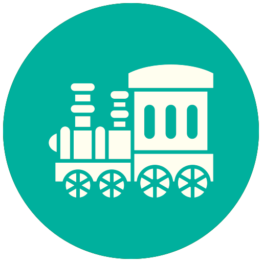
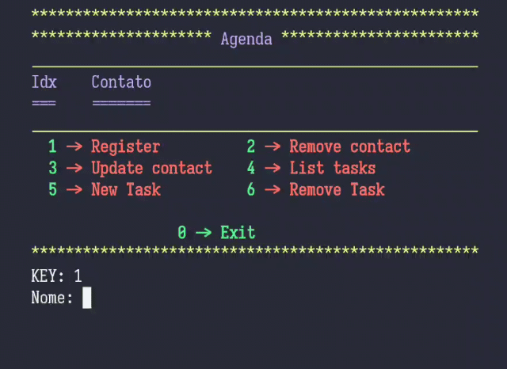
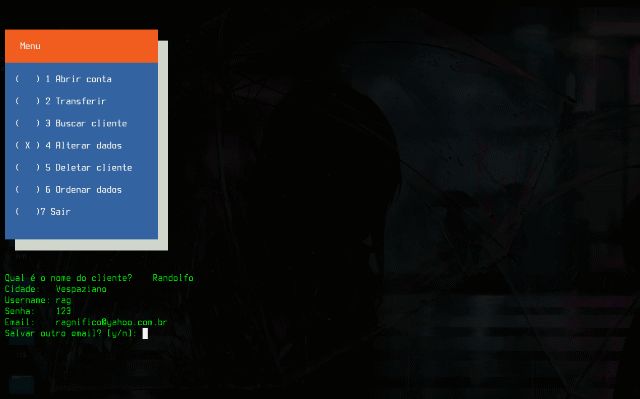

-----

-----

  

 

------
## Rag

<table>

<tr> 

<td>

</td>

<td>

<h3>

<i> Me chamo Randolfo Augusto e sou natural de Belo Horizonte, formado em Filosofia pela UFMG em 2017. Atualmente sou Estudante de Engenharia da Computação da Faculdade <a href="https://newtonpaiva.br/" target="_blank">Newton Paiva</a>, no entanto estudo programação dês de 2018</a>.</i> 

</h3>

<h4>

- 🥰   Tenho um caso de amor eterno com C++
- 🐟   Sou Pisciano, portanto iludido por natureza. 
- 🧙   Minhas Mídias prediletas são filmes de ficção, terror, e animes. 
- 😍   Curto fazer trilha, e comer 🍝(comidas) exóticas. 
- 💬   Adoro debates reflexivos.
- 📄   Veja meu Currículo para mais [informações]().

</h4>

</td>

</tr>

</table>

-----

## Galeria

<table>
<tr>

<td>
</td>

<td>
</td>

</tr>    

<tr>

<td>
</td>

<td>
</td>

</tr>

</table>

-----

## Linguagens e Ferramentas

<code></code>&nbsp; 
<code></code>&nbsp; 
<code></code>&nbsp; 
<code></code>&nbsp; 
<code></code>&nbsp; 
<code></code>&nbsp; 
<code></code>&nbsp; 
<code></code>&nbsp; 
<code></code>&nbsp; 
<code></code>&nbsp; 
<code></code>&nbsp; 
<code></code>&nbsp; 
<code></code>&nbsp; 
<code></code>&nbsp; 
<code></code>&nbsp; 
<code></code>&nbsp; 

 

 

 

     
   

 

-----
## Git Status

-----

 

## Rag - Som

<table>

<tr>
<td>

</td>
<td>
   
 

</td>

</tr>

</table>

-----

## Contribuições

<td></td>
<td></td>

